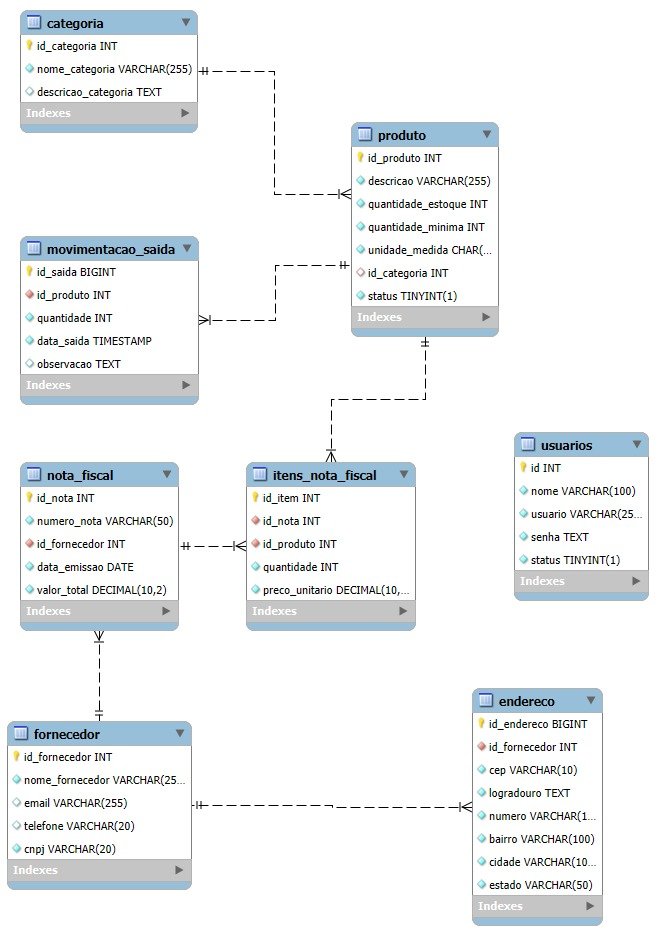

# Controle de Estoque - API REST

## 📌 Sobre o Projeto
Este projeto consiste em uma API REST para controle de estoque, permitindo o gerenciamento de produtos, fornecedores, entradas e saídas de itens. Foi desenvolvido utilizando **Java, Spring Boot e PostgreSQL** e inclui autenticação e autorização com **Spring Security**.

## 🚀 Funcionalidades
- ✅ **Cadastro e autenticação de usuários**
- ✅ **CRUD** (criação, leitura, atualização e remoção)
- ✅ **Cadastro de fornecedores**
- ✅ **Cadastro de categorias**
- ✅ **Cadastro de produtos**
- ✅ **Registro de entradas e saídas de produtos**
- ✅ **Geração de notas fiscais para entrada de produtos**
- ✅ **Documentação completa da API com Swagger**

## 🛠️ Tecnologias Utilizadas
-  **Java 17** ☕
-  **Spring Boot** 🌱
-  **Spring Security** 🔒
-  **Spring Data JPA** 📊
-  **PostgreSQL** 🐘
-  **Maven** ⚙️
-  **Swagger OpenAPI** 📜
-  **Railway** ☁️

## 🎯 Como Executar o Projeto
### ✅ Pré-requisitos
Antes de rodar o projeto, certifique-se de ter instalado:
- 📌 [Java 17+](https://www.oracle.com/java/technologies/javase/jdk17-archive-downloads.html)
- 📌 [Maven](https://maven.apache.org/)
- 📌 [PostgreSQL](https://www.postgresql.org/download/)

### 🚀 Passos para execução
1. 📥 Clone o repositório:
   ```sh
   git clone https://github.com/Thi-barros/API-controle-de-estoque
   ```
2. 📂 Acesse o diretório do projeto:
   ```sh
   cd API-controle-de-estoque
   ```
3. ⚙️ Configure o banco de dados no `application.properties`:
   ```properties
   spring.datasource.url=jdbc:postgresql://localhost:5432/nome_do_banco
   spring.datasource.username=postgres
   spring.datasource.password=senha
   ```
4. ▶️ Execute o projeto via Maven:
   ```sh
   mvn spring-boot:run
   ```
5. 🌐 Acesse a API pelo navegador ou ferramentas como Postman:
   ```
   http://localhost:8080/api
   ```
6. 📄 Acesse a documentação do Swagger (pode testar a aplicação pelo Swagger):
   ```
   http://localhost:8080/swagger-ui.html
   ```

## 🔐 Segurança
O sistema utiliza **Spring Security** para autenticação e controle de acesso. Para acessar a API, é necessário realizar login e obter um token JWT.

## 🚀 Deploy na Nuvem
A API está hospedada na plataforma **Railway**, facilitando o acesso e a escalabilidade.

## 📊 Modelo do Banco de Dados
A estrutura do banco de dados inclui tabelas para **usuários, produtos, fornecedores, endereço do fornecedor, notas fiscais, itens de nota fiscal e movimentações de saída de estoque**. 
<p align="center">
  
</p>

## ✉️ Contato
📧 Para dúvidas ou sugestões, entre em contato pelo e-mail: **thiagoo.barros08@gmail.com**.

